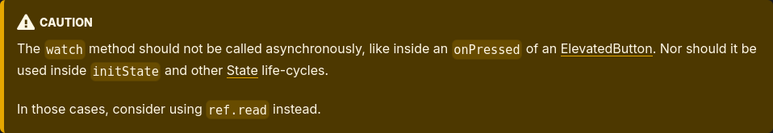

+++
title = "Flutter, Elm and LVGL: a Three Way Comparison"
slug = "flutter-elm-lvgl"
date = 2025-05-27

[taxonomies]
topics = ["flutter", "elm", "lvgl", "rant", "ui"]
+++

In my line of work I frequently need to develop user interfaces for a variety of purposes and platforms.
For the most part, it's an interesting endevour. There's artistry involved in orchestrating an intuitive, effective and efficient interface.

> On the other hand, painstakingly trying to align that button to all its peers when the framework just refuses to do so never gets any less frustrating.

Speficically, managing the entwinement between UI structure and data flow is a very engaging task. Data is ordered and rigorous, while the screen is frequently made up of similar but not quite identical building blocks that are difficult to abstract properly. The two components must dance in harmony while keeping each other at an arm's length for safety.

It may seem trivial - I know it did to me at first! - but proper architecture is paramount here. The UI is a monster in disguise: in spite of being one of the least important parts (from a software perspective), it can easily become the biggest component, clinging to the rest of the project with deep, hard to remove dependency tendrils.

Over the years I've racked up a decent experience with multiple, sometimes radically different solutions to these challenges.
Today I'd like to compare three UI frameworks in order to make a case about proper library design, criticizing one of them in them process.

## LVGL

Possibly the lesser known tool among those I'll mention today, [LVGL](https://github.com/lvgl/lvgl) holds a special place in my heart. It is the only practical UI library for embedded devices (that I know of) and most of my work wouldn't be possible without it.

> Others obviously exist, but are mostly held back by [proprietary tooling](https://www.st.com/en/development-tools/touchgfxdesigner.html) or [licensing hurdles](https://www.qt.io/qt-licensing).

It's made in C with focus on portability, low resource usage and efficiency.\
Between the programming language and the preferred targets one could expect quite a harsh experience; instead, working with LVGL is surprisingly pleasant. Let's see a small example:

```C
// Example based on LVGL 9.0

#include <stdlib.h>
#include <stdint.h>
#include <unistd.h>
#include "lvgl.h"


static int counter = 0;


static void button_event_cb(lv_event_t *e) {
    lv_obj_t *label = lv_event_get_user_data(e);
    counter++; // Application logic
    lv_label_set_text_fmt(label, "Clicked %i times", counter); // Update the UI
}

int main(void) {
    lv_init(); // Initialize the library

    lv_sdl_window_create(720, 480); // Create an SDL window
    lv_sdl_mouse_create();          // Connect an input device (the mouse)

    // Create a button
    lv_obj_t *button = lv_button_create(lv_screen_active());
    lv_obj_center(button);
    // A label inside it
    lv_obj_t *label = lv_label_create(button);
    lv_label_set_text(label, "Click me!"); // Initial text
    lv_obj_center(label);
    
    // When the button is pressed, invoke `button_event_cb`
    lv_obj_add_event_callback(button, LV_EVENT_CLICKED, button_event_cb, label);

    for(;;) {
        lv_handler(); // Handle the library asynchronously
    }

    return 0;
}
```

While not exactly up to the standard of higher level frameworks, the code remains fairly readable by virtue of being dead simple: create a button with some text inside; when the button is clicked call a function; within this callback manage some application logic and update the UI accordingly.

When properly setup and compiled (the library is only distributed from sources and C doesn't have a package manager, so it's not straightforward), you are greeted by something like this:


Depending on what you are used to, this approach may look primitive - and it is. It is based on retained state UI with a *very* imperative API.\
You want a button? Create one. 
You want to know when it has been clicked? Attach a callback to it.
You need to update the label with the new state? You better keep track of that pointer.

It is archaic in the sense that the developer is responsible for everything. There are reasons for that of course - performance being the first in line - but the fact doesn't change that it leaves you vulnerable to a plethora of nasty bugs.\
For example, I mentioned that UI and business logic should be kept distinct. It is not the case in this example: `button_event_cb` acts out the application logic but needs to be attached to the UI directly (it even takes a UI data type as parameter). 

To separate them we could try something like this:

```C
#include "model.h"

static void button_event_cb(lv_event_t *e) {
    model_increase_counter();

    lv_obj_t *label = lv_event_get_user_data(e);
    lv_label_set_text_fmt(label, "Clicked %i times", model_get_counter());
}
```

The application data is now hidden in a `model` that can be developed and tested separately from the UI. The label update should probably be moved somewhere else with an event system to cover the eventuality of a counter change due to different sources, but you get the idea. 

This is a good starting point, but it was on me (i.e. the developer) to implement it. What if I didn't know any better? How long would it take me to reach a satisfying solution? What about other similar issues, like splitting the UI in pages or implementing some kind of navigation stack?

LVGL just helps you putting stuff on the screen; this kind of features is your responsibility.
Suffice to say, it took me quite a lot of trial and error to implement them properly, with clean and maintainable results.

This is unfortunate, but I want to focus on what's good. The *intent* of the library, for example, is **extremely** clear. 
Most programmers will be familiar with the imperative style - it's arguably the simplest to start with - and understand how that works right away. 
You may consider it verbose and somewhat hard to read, but thanks to its simplicity the API is exceptionally intuitive, communicating immediately and perfectly how it works.\
Create a widget, attach a callback, modify the widget. Couldn't be any more limpid.

## Elm

To the extreme opposite end of the spectrum we find [Elm](https://elm-lang.org/).

First of all, it builds web applications, so it's aimed at a completely different target. While I deem it more of a UI framework it is technically also a programming language - although a domain-specific one. 
It could be described as a much simpler version of Haskell; accordingly, its most prominent feature is a purely functional nature. 
It's definitely a somewhat exotic approach to UI development but one that fits surprisingly well. 

As a library, Elm funnels the developer experience into an hyperspecific and rigid application structure called The Elm Architecture (TEA for short).
In a nutshell TEA is based on three simple components:

 - `Model`: the application's data, as in [all of it](https://en.wikipedia.org/wiki/Single_source_of_truth). A single data structure and reference where every information internal to the program is stored and modified - not directly since all data is immutable in Elm, but by instantiating a new value every time.
 - `View`: a function that converts the `Model` into a UI representation that can be displayed on a browser, closely related to HTML but still described with Elm's own data structures.
 - `Update`: a function that takes the current `Model`, an event (something coming from the UI or the underlying system) and returns a new `Model`.

Let's take a look at another counter application example to get acquainted with it:

```elm
module Main exposing (main)

import Browser
import Html exposing (Html, button, div, text)
import Html.Events exposing (onClick)


-- Application data
type alias Model =
    { counter : Int }


-- Initial value for the `Model`
initialModel : Model
initialModel =
    { counter = 0 }


-- Event type
type Msg = Increment


-- Application logic
update : Msg -> Model -> Model
update msg model =
    case msg of
        Increment ->
            { model | counter = model.counter + 1 }


-- UI construction
view : Model -> Html Msg
view {counter} =
    div []
        [ button [ onClick Increment ] [ text <| "Clicked " ++ (String.fromInt counter) ++ " times" ] ]


-- Tying everything together with `Browser.sandbox`
main : Program () Model Msg
main =
    Browser.sandbox
        { init = initialModel
        , view = view
        , update = update
        }
```

You can see the example in action [here](https://ellie-app.com/tjSLxFccpFPa1).

Every piece is trivial by itself, and the combination reaches its peak of complexity in the `Browser.sandbox` call. That's the framework's entry point for defining an application: it just collects the three components and ties them up. The resulting code is clear and readable, although a bit verbose at times.

> One may take a look at Elm and argue that the functional approach is not so understandable in general, but counter-arguably that's only due its non conventional nature; it becomes clear once you get used to the paradigm.

It's worth nothing how the button's click is connected to the incrementing action: the UI representation (`Html Msg`) depends on the `Msg` type, and the `button` element is assigned `Increment` as message to send on click. When such an event occurs the framework simply invokes `update` and updates the `Model` with the result.

This approach solves the division of application and UI logic with a radical approach: the existence of the latter is simply denied. Since UI is just a data structure, it can contain no logic at all!

> Technically one may engage in some major tomfoolery by passing a function in lieu of the message (writing something like `button [onClick (\model -> {model | counter = model.counter + 1})]`) and reduce `update` to just calling that same function when it is delivered. In a way this is like injecting logic back into a dry UI. There are some edge cases where it may be useful but I generally don't recommend it.

Perhaps the most exotic aspect of an Elm application is how the UI is delivered. Instead of procedurally building a widget tree and updating the same widgets through some kind of reference according to the data, a new immutable description of the entire interface is returned. 

Isn't that inefficient? [Apparently not](https://elm-lang.org/news/blazing-fast-html-round-two).
The catch is that the Elm runtime internally caches the DOM tree, diffs the new UI representation returned by `view` and only applies the required changes for maximum performance. This allows you to reap the benefits of a simplified, immutable approach without having to sacrifice performance.

## Great Tools Work Alike

It is hopefully obvious just how different LVGL and Elm are. One is a low-level and heavily reliant on a mutating internal state; the other creates a high-level interface of immutable data and pure functions to strictly direct the application flow. Beyond their implementation and API however they share three characteristics of supreme importance:

<div id="great-tools-points">

 1. You don't need to know the internal details of the framework to use it. Implementation details and optimization strategies do not transpire from the API; while interesting in its own right, that information would only cause unnecessary friction - or worse, *confusion* - when using the library.
 2. The function and intent of every part of the framework is always crystal clear. There is rarely more than one obvious way to achieve the desired result.
 3. Greater features are implemented by combining basic building blocks. A light skim of the documentation will leave you capable of building any UI, no matter how complex, by applying repeatedly the few foundational principles of each framework.

</div>

> There are specific situations where delving deeper into implementation details is necessary, but such is the tradeoff when particular performance is required. For example, LVGL widgets can be disassembled and fine tuned for fast drawing, and the evaluation of Elm elements can be postponed if they are not displayed on the screen by enclosing them in lazy wrappers.

These three pillars make the learning process for both tools expedite and pleasant. Once the requirements are set, little time is wasted pondering how they can be realized by the code, and the answer to any technical question is found quickly with little to no debate.\
This applies even when the framework doesn't provide an integrated route (I'm referring to LVGL especially). "Roll up your sleeves and do it yourself however you see fit" is still a direct response.

It may be tempting to attribute such effectiveness to a will written documentation documentation, but although it is another aspect that can be praised for both projects, that's not it: the frameworks themselves are built in such a way that the flow of information and control is always crystal clear. The tool works with you, not against you.

To me, this should be the main requirement any library should strive to meet; yet, I'm about to complain extensively of an extremely popular framework that goes full speed in the opposite direction.

## Flutter

Developing UIs is all sunshine and roses until they have to work on multiple devices.
The need for cross-platform application development has spawned a never ending undergrowth of tools, libraries and frameworks. Each claims to succeed, but no approach is entirely satisfying. 

> You can (almost) always compile whatever you are dealing with to a web page - Elm does that directly and even C can be compiled to webassembly with `emcc` - and then transform to a ""native"" application via a webview. That's what most of those cross-platform framework do under the hood anyway.

The one that creates the most pleasant results for the least amount of headaches - in my experience at least - is Flutter. 
Backed by an active community and a continous, significant investment from big G, Flutter makes targetting different platforms doable. I can reliably develop an application on my Linux development machine and then spend only a few days to deploy it everywhere else.

While this remains a big reason to choose it in practice, my words of praise end here: the framework itself is nothing short of a mess.
To understand what's wrong with it, let's try to replicate the same counter example that we should know well by know.

Dart is a traditional imperative and object oriented programming language, but the UI construction has a declarative twist: each `Widget` object must implement a `build` method which returns another `Widget` (possibly in a nested organization), describing a tree-shaped UI.\
You, the developer, are expected to define custom object that subclass something from the `Widget` family line. One of the most basic classes one can rely on in Flutter is the `StatelessWidget`. Being an object in an object-oriented programming language it can absolutely have a state, so what's with the name? 

Well, a `StatelessWidget` is not *supposed* to have a state because it wouldn't matter for the UI. Its `build` method is only called once when it's created and it will ignore any future modifications (like incrementing a internal counter).

To implement something remotely interesting we must turn to another class, the `StatefulWidget`. Ah, this one will surely allow me to keep track of an internal state and update the UI accordingly, right? Yes, but *not by itself*. 

I've beaten around the bush long enough; let's see some code:


```dart
import 'package:flutter/material.dart';

void main() {
  runApp(const MaterialApp(
    title: 'Flutter Demo',
    home: CounterWidget(),
  ));
}

class CounterWidget extends StatefulWidget { // Counter Widget
  const CounterWidget({super.key});

  @override
  State<CounterWidget> createState() => CounterState();
}

class CounterState extends State<CounterWidget> { // State object for the Counter Widget
  int counter = 0;

  CounterState();

  @override
  void initState() {
    super.initState();
    this.counter = 0;
  }

  @override
  Widget build(BuildContext context) {
    return Center(
      child: ElevatedButton(
        onPressed: () {
          this.setState(() {
            this.counter++;
          });
        },
        child: Text(
          "You clicked ${this.counter} times",
        ),
      ),
    );
  }
}
```

Despite the simplicity of the example, there is a lot to unpack here.

### Shaky Foundations

Notice how I needed to create two separate classes in order to implement a counting widget: `CounterWidget` and `CounterState`. Looking at the names alone one may assume the former to describe the UI and the latter to encapsulate the data behind it; the code, however, tells a different story.

`CounterWidget` is nothing but boilerplate. It serves no particular function beside proclaming its existence and affiliation with `CounterState` which on the other hand pulls all the weight, keeping track of the `counter` and overriding `build`.\
There are two main issues with this approach:

 1. I had to declare two classes for a single custom widget. Worse of all, one of them carries no relevant information. That is quite a heavy burden for what's supposed to be the bread and butter of the library.
 2. The UI description is handled by the class called `State`, not the one with `Widget` in its name. It is a profoundly confusing design choice that will never not aggravate me (and honestly the main drive for this rant).

> Yes, I'm aware that [code snippet generation is a thing](https://marketplace.visualstudio.com/items?itemName=Nash.awesome-flutter-snippets). It doesn't solve the underlying issue: resulting code is still harder to read.

Now let's take a look at how and where the framework handles refreshing the screen. You are not supposed to call `build` yourself, so it's not your direct responsibility as in LVGL. We had to create a different class specifically for the `State` part, so maybe the runtime will recognize when that changes like Elm does?

Nope, nothing so simple. Subclassing `State` is mainly to get access to the `setState` method. It is a somewhat peculiar function, one that takes an arbitrary closure as sole parameter: you are expected to use this anonymous function to modify the state the UI depends on; when that happens `build` will be called again to update the screen.\
This sophisticated-sounding passage hints at some deeper mechanism where every mutation is carried on in a special context. I was convinced of that too, until I decided to unwrap the ridicolous hell that is state management in Flutter. 

It turns out that `setState` simply triggers a rebuild of the widget and that's it. The closure is called to ensure the change but nothing prevents it from happening before the function.
I suppose this is an attempt at isolating mutation even when there is no reasonable path to enforce it; as it stands, it just creates a silly aura of mistery.

> Yes, I realize I am nitpicking. I'll also use `setState` inappropriately from now on, out of spite.

It is safe to say that the base is a little convoluted, but at least now we have a clearer picture. Flutter appears to take an hybrid approach: the UI is constructed declaratively thorught `build` methods and mutation is injected with manual `setState` invokation. In the end it's simple enough, right?

Superficially, this assessment is more or less correct and it allows you to start developing right away. Eventually, however, you will start stumbling into weird behavious: UIs that don't update when they should, cryptic runtime errors, the data flow between application components becoming more and more viscous; overall a suffocating sense of confusion, where every solution brings even more questions into play.

Let me show you a few examples of the horrors that lurk below the surface.

### Lost in the Forest(s)

I have used a very precise word to explain how declarative frameworks like Elm and Flutter construct the UI: it is *described* by a widget tree returned by a function. Both frameworks take this description and elaborate them to rule out unnecessary work before actually displaying anything on the screen.

More specifically, `Widget`s are blueprints to produce a different type of tree: the `Element` tree. When a `Widget` needs to be displayed it creates an `Element` in its image; repeat the process for every `Widget` and you get a mirrored tree of objects. `Element`s mantain a reference to their creating `Widget`. Similarly to Elm, whenever a new `build` is invoked Flutter transverses the `Element` tree and for every node checks if something has changed in the corresponding `Widget`, compares these two trees and updates the latter to match the former.

> There is actually a third tree created by `Element`s, the `ObjectRenderer` tree. I never needed to learn how that works in order to work with Flutter, but I guess YMMV.

Just like `Elm`, this process is in place for performance reasons. Comparing the two trees allows the framework to only apply the required changes, saving resources and computational effort. 
However, there is a huge flaw in this process. Unlike Elm, the `Widget` tree is more than a mere, immutable description of the UI: it is where your whole application lives; `Widget`s may contain mutable fields, data and references that live alongside the application. This becomes an issue because the `Widget` tree is ephemeral, rebuilt on a whim when the backing state changes with potentially disrupting effects.

"Hey!" I hear you object. "That's the reason you are supposed to store state inside `State` subclasses!". Sure, let me dig a little bit deeper into this can of worms.

As the kind fellow in the crowd pointed out, mutable state should be stored inside the `State` part of a `StatefulWidget`. Those object survive widget tree rebuilds because, despite having a `build` method, they are not `Widget`s. 

This is, once again, extremely confusing. What about separation of concerns? Why is the class that is supposed to handle the state also burdened with creating the UI?
Logically, the `StatefulWidget` should have had a reference to the `State` while building its own subtree, leaving `State` to mind its data business. `setState` could stay where it is and act as notifier for the widget that the UI needs to be refreshed.

> A data-only version of `State` actually exists within Flutter: it's called `ChangeNotifier` (or `ValueNotifier`, or `Cubit` depending on the flavor) and it becomes the de facto standard to handle state once you go past the tutorial. It mostly renders `StatefulWidget` obsolete, highlighting the bad design at its core.

But wait, it gets worse. Since `State` objects aren't actually `Widget`s they don't live under the corresponding tree; they are kept inside the `Element` tree. \
To understand what difference it makes let's look at a variation of the previous example. Let's say that our counting application is gaining traction but some users would like to count multiple things with ordered (but flexible) priorities. 

Previously we used a single instance of `CounterWidget`; now we add a `String` label field and create two separate ones. This field is just a copy: the original labels are kept ordered in the parent `CounterListWidget` with the possibility to swap them with a button. 

```dart
import 'package:flutter/material.dart';

void main() {
  runApp(const MaterialApp(
    title: 'Flutter Demo',
    home: CounterListWidget(),
  ));
}

class CounterListWidget extends StatefulWidget {
  const CounterListWidget({super.key});

  @override
  State<CounterListWidget> createState() => CounterListState();
}

class CounterListState extends State<CounterListWidget> {
  List<String> names = ["Main", "Secondary"]; // Counter priorities

  @override
  Widget build(BuildContext context) {
    return Center(
      child: Column(
        children: [
          CounterWidget(name: this.names[0]),
          CounterWidget(name: this.names[1]),
          ElevatedButton(
            onPressed: () {
                // Invert the current priorities
                this.names.insert(1, this.names.removeAt(0));
                this.setState(() {});
            },
            child: const Text("Swap"),
          ),
        ],
      ),
    );
  }
}

class CounterWidget extends StatefulWidget {
  final String name;
  const CounterWidget({required this.name, super.key});

  @override
  State<CounterWidget> createState() => CounterState();
}

class CounterState extends State<CounterWidget> {
  int counter = 0;

  CounterState();

  @override
  void initState() {
    super.initState();
    this.counter = 0;
  }

  @override
  Widget build(BuildContext context) {
    return Center(
      child: ElevatedButton(
        onPressed: () {
          setState(() {
            this.counter++;
            setState(() { });
          });
        },
        child: Text(
          '${this.widget.name} clicked ${this.counter} times',
        ),
      ),
    );
  }
}

```

It works as expected, but not for long.
Notice how the name is retrieved by access the `CounterWidget` instance from `CounterState` through to the `widget` field.
Say we want to keep the counter's name inside its `State` - it's data after all, and we don't like the additional indirection. Slightly modify `CounterState` to include a `name` field:

```dart
class CounterWidget extends StatefulWidget {
  final String name;
  const CounterWidget({required this.name, super.key});

  @override
  State<CounterWidget> createState() => CounterState(this.name); // Pass the name down (up?) to the state
}

class CounterState extends State<CounterWidget> {
  final String name; // <-- new name field
  int counter = 0;

  CounterState(this.name);

  @override
  void initState() {
    super.initState();
    this.counter = 0;
  }

  @override
  Widget build(BuildContext context) {
    return Center(
      child: ElevatedButton(
        onPressed: () {
          this.counter++;
          this.setState(() {});
        },
        child: Text(
          '${this.name} clicked ${this.counter} times',
        ),
      ),
    );
  }
}
```

Neat. Run it and see how the click event stops working. Why?

In broad strokes, `setState` marks its `Widget` as dirty, triggering a rebuild; the framework then traverses the `Element` tree and for each node checks whether the corresponding `Widget` is of the same type it was before (i.e. `CounterWidget`); it is, so it only updates the `Widget` reference inside `Element`.
When `name` is inside the `CounterState` the UI doesn't update properly because `Element` only updates the reference to the `Widget`, not the `State`. The `State` is then responsible for recreating the `Widget` but since it didn't change the result is identical to the previous frame. \
Why does the swap work when `CounterState` is not involved? Beats me, probably something about `CounterWidget` getting recreated regardless.

Despite emerging in a fabricated example, [the issue is real enough to have an explicit workaround](https://www.youtube.com/watch?v=kn0EOS-ZiIc). When searching for differences in a rebuild Flutter checks two things: the type and the *key* of the widgets. `Key`s can be explicitly attached to widgets that are tied in this stalemate to make the runtime able to distinguish them. If we add keys to `CounterWidget`s like so `CounterWidget(key: UniqueKey()` the demo works again.

Figuring out why the UI is not updating after a state change and finding out where you should add a key or move a reference to fix it will drive you crazy. Moreover, conundrums like these can arise without making any conceptual mistake: whether `name` belongs inside or outside `CounterState` can be contentious, but I wouldn't say it either way is absolutely wrong.\
Finally, while applying `Key`s makes the `Widget` tree recognize the update again it doesn't fix the underlying issue, because now every time the counters are swapped their state is rebuilt from scratch, resetting the `this.counter` as well.

The bigger problem is the irresponsible mixture between UI and data at the framework level. We will see more examples of this soon.

### Widgets, Widgets Everywhere

One of the core tenets of Flutter is that "everything is a Widget". There are some aspects that make this approach very appealing: It greatly simplifies building the UI because it does away with a lot of unnecessary clutter, mainly in the form of layout and styling languages. No longer is the project split between `xml`, `xaml`, `qml`, or even `css` stylesheets: just Dart all the way through.\
As a result, the development process is much more linear. The very act of creating a UI is extremely straightforward and behaviour can be easily injected by virtue of callbacks.
Layout is specified by composing widgets, mainly `Rows` and `Columns` (they have a few quirks but are very [flex](https://api.flutter.dev/flutter/widgets/Flex-class.html)ible when wielded correctly); in the same way padding, margin and spacing (whatever the difference is) can all be specified by placing and nesting appropriate widgets.

This also makes abstracting and parametrizing reusable pieces of the interface very natural. Let's try it a little bit: those two counters of the previous example are packet too tight; add a couple of `SizedBox` spacers:

```dart
  @override
  Widget build(BuildContext context) {
    return Center(
      child: Column(
        children: [
          Padding(
              padding: const EdgeInsets.all(16),
              child: CounterWidget(name: this.names[0], key: this.key1)),
          Padding(
              padding: const EdgeInsets.all(16),
              child: CounterWidget(name: this.names[1], key: this.key2)),
          ElevatedButton(
            onPressed: () {
                // Invert the current priorities
                this.names.insert(1, this.names.removeAt(0));
                this.setState(() {});
            },
            child: const Text("Touch"),
          ),
        ],
      ),
    );
  }
```

Slightly better, but the code is starting to repeat itself. Nothing dramatic, it makes for a good exercise: since the UI is just code we can easily fix it with a sprinkle of abstraction.

```dart
  @override
  Widget build(BuildContext context) {
    Widget createPaddedCounter(String name) => Padding(
          padding: const EdgeInsets.all(16),
          child: CounterWidget(name: name),
        );

    return Center(
      child: Column(
        children: [
          createPaddedCounter(this.names[0]),
          createPaddedCounter(this.names[1]),
          ElevatedButton(
            onPressed: () {
                // Invert the current priorities
                this.names.insert(1, this.names.removeAt(0));
                this.setState(() {});
            },
            child: const Text("Touch"),
          ),
        ],
      ),
    );
  }
```

Very satisfying, isn't it? Unexpectedly, also wrong. I mean, it works, but according to Flutter etiquette [you absolutely shouldn't do it](https://www.youtube.com/watch?v=IOyq-eTRhvo). 

To clarify, this taboo is not focused on the act of abstracting out a repeating piece of the UI, but on the fact of using functions - you know, one of the most basic form of abstraction - to do so. The proper path to follow would be to define an entirely new `Widget` class, like so:

```dart
class PaddedCounterWidget extends StatelessWidget {
  final String name;

  const PaddedCounterWidget(this.name, {super.key});

  @override
  Widget build(BuildContext context) => Padding(
        padding: const EdgeInsets.all(16),
        child: CounterWidget(name: this.name),
      );
}

/* ... */

  @override
  Widget build(BuildContext context) {
    return Center(
      child: Column(
        children: [
          PaddedCounterWidget(this.names[0]),
          PaddedCounterWidget(this.names[1]),
          ElevatedButton(
            onPressed: () {
                // Invert the current priorities
                this.names.insert(1, this.names.removeAt(0));
                this.setState(() {});
            },
            child: const Text("Touch"),
          ),
        ],
      ),
    );
  }
```

To me this is worse, although not unreasonably so. Functions are simply easier to use, require less code and in dart can be nested inside any block, all qualities that greatly improve code readability. I was quite surprised to learn that in Flutter `Widget`-returning functions are considered a code smell and went on to document myself on the matter; I encourage you to do the same by reading [this lengthy github discussion about it](https://github.com/flutter/flutter/issues/19269).

Personally, I find the reasons behind it to be hazy and unsubstantial. The general idea is that Flutter works well with `Widget`s and functions - even when they return a `Widget` - break this flow. 
Perhaps by add a new `Widget` class we help the comparison algorithm to find changes in the UI (on account of it relying on the `Widget`'s type to spot differences), but apparently the [performance aspect is negligible](https://github.com/flutter/flutter/issues/19269#issuecomment-490643024). \
A new class also sticks out more clearly when inspecting the widget tree on the debugger, something I admittedly don't rely much on; even if I did, when I need to abstract UI fragments it's usually just for code reuse, something that wouldn't warrant this kind of special attention.

The whole situation is downright bizarre. It seems like `Widget`s are favored over all else - even when they are a poor alternative - just for the sake of "everything is a Widget". 

> In the end, a `StatelessWidget` is just a function with extra steps and less features; so much so that [a library exists to convert the latter into the former with code generation](https://pub.dev/packages/functional_widget). Clever, but adding metaprogramming for such a small task is overkill.

### Static Typing, Dynamic Errors

Let's circle back to the initial comparison for a moment. 

Elm applications tipically enjoy a very small number of runtime bugs by virtue of the language being purely functional and statically typed. \
On the opposite side of the spectrum we have LVGL, forced by C's scarce type system to handle every widget under the same `lv_obj_t *` pointer - with manually allocated memory, too! Keeping track of every `lv_obj_t` reference and type is an heavy responsibility, and segmentation faults are a daily occurence during development.

Where is Flutter positioned in this scale? While still imperative, Dart sports an advanced static type system. This, paired with the fact that Flutter's `Widget` tree is costructed declaratively will surely reduce such problems to a minimum, right?

> Dart as a language is far, far away from solid type safety, but I don't want to hold the sins of the language over the framework. It has plenty of its own. 

Let's verify this claim with another example. Taking advatage of Flutter's cross platform nature we started distributing our successful counter app to different targets. Now users can count many things over multiple devices, but they'd like every counter to be synchronized. Once a cloud infrastracture is in place the application should be updated to report each increment request through the internet before modifying its own internal state. \
Network operations are a common occurrence in mobile applications, and Dart's `async` capabilities are the perfect tool to implement interfaces that handle long-running background requests.

For the sake of the example, we will emulate an HTTP request with a simple delayed future. Within `CounterState` we turn the `onPressed` callback into an `async` function and wait for the "network operation" to be over before acting on the local state:

```dart
          ElevatedButton(
            onPressed: () async {
              // Report the increment event to the remote server
              await Future.delayed(const Duration(seconds: 2));

              this.counter++;
              this.setState(() {});
            },
            child: Text(
              '${this.name} clicked ${this.counter} times',
            ),
          ),
```

That was fairly easy, but the delay between a button click and the update is making the UI feel sluggish. A user may tap the counter repeatedly thinking it's stuck, firing multiple unintended events. Since the internet connection can be arbitrarily slow we should show that work is happening in the background with a loading indicator. We add a `loading` flag to `CounterState` and update the `build` method accordingly:

```dart
class CounterState extends State<CounterWidget> {
  int counter = 0;
  bool loading = false; // Network operation flag

  CounterState();

  @override
  Widget build(BuildContext context) {
    return Center(
      child: this.loading 
          ? const CircularProgressIndicator() // When loading show a circular spinner
          : ElevatedButton( // Otherwise continue with the normal UI
              onPressed: () async {
                this.loading = true; // Set the loading flag
                this.setState(() {});

                await Future.delayed(const Duration(seconds: 2));

                this.loading = false; // Clear the loading flag 
                this.counter++;       // and update the state
                this.setState(() {});
              },
              child: Text(
                '${this.name} clicked ${this.counter} times',
              ),
            ),
    );
  }
}
```

Grand. But wait, there's a bug report! Swapping the two counters while a network request is in progress leaves the client in an inconsistent state with the server. Pending remote operations should disable all buttons, not just the specific counter's. 
The solution is to move `loading` from `CounterState` to `CounterListState` and pass a reference of the latter to the former so the `onPressed` event can still modify it.

```dart
class CounterListState extends State<CounterListWidget> {
  List<String> names = ["Main", "Secondary"];
  bool loading = false;

  @override
  void initState() {
    super.initState();
  }

  @override
  Widget build(BuildContext context) {
    return Center(
      child: this.loading
          // Replace the whole page with a progress bar when loading
          ? const CircularProgressIndicator()
          : Column(
              children: [
                CounterWidget(name: this.names[0], state: this), // Pass a reference to the upper state to the lower widgets
                const SizedBox(height: 16),
                CounterWidget(name: this.names[1], state: this),
                const SizedBox(height: 16),
                ElevatedButton(
                  onPressed: () {
                    this.names.insert(1, this.names.removeAt(0));
                    this.setState(() {});
                  },
                  child: const Text("Touch"),
                ),
              ],
            ),
    );
  }
}

class CounterWidget extends StatefulWidget {
  final String name;
  final CounterListState state;
  const CounterWidget({required this.name, required this.state, super.key});

  @override
  State<CounterWidget> createState() => CounterState(this.name);
}

class CounterState extends State<CounterWidget> {
  int counter = 0;

  CounterState();

  @override
  Widget build(BuildContext context) {
    return Center(
      child: ElevatedButton( 
          onPressed: () async {
            this.widget.state.loading = true; // Set the loading flag (in the upper state)
            this.widget.state.setState(() {});

            await Future.delayed(const Duration(seconds: 2));

            this.widget.state.loading = false; // Clear the loading flag 
            this.widget.state.setState(() {});
            this.counter++;       // and update the state
            this.setState(() {});
          },
          child: Text(
            '${this.name} clicked ${this.counter} times',
          ),
        ),
    );
  }
}
```

This should display a spinner instead of the whole UI when a request is pending and restore everything once it's finished. Unfortunately, you get an email from your quality assurance guy reporting this *totally clear and immediately understandable error*:

```
[ERROR:flutter/runtime/dart_vm_initializer.cc(41)] Unhandled Exception: setState() called after dispose(): CounterState#a957f(lifecycle state: defunct, not mounted)
This error happens if you call setState() on a State object for a widget that no longer appears in the widget tree (e.g., whose parent widget no longer includes the widget in its build). This error can occur when code calls setState() fr
om a timer or an animation callback.
The preferred solution is to cancel the timer or stop listening to the animation in the dispose() callback. Another solution is to check the "mounted" property of this object before calling setState() to ensure the object is still in the
 tree.
This error might indicate a memory leak if setState() is being called because another object is retaining a reference to this State object after it has been removed from the tree. To avoid memory leaks, consider breaking the reference to
 this object during dispose().
#0      State.setState.<anonymous closure> (package:flutter/src/widgets/framework.dart:1167:9)
#1      State.setState (package:flutter/src/widgets/framework.dart:1202:6)
#2      CounterState.build.<anonymous closure> (package:flutter_experiments/main.dart:99:22)
```

The logger vomits out this stack trace exactly two seconds after the counter button is pressed, leaving the loading screen on indefinitely.

I'll spare you the decryption effort: after setting `this.widget.state.loading = true`, `CounterState`'s `onPressed` is suspended at the `await` point until the "network request" is over. At that moment a tree rebuild is started because `setState` has marked `CounterListState` as dirty. `CounterListWidget` is recreated, this time only showing `CircularProgressIndicator`; this means that there are no more `CounterWidget`s and their corresponding `CounterState`s are disposed of. However, our future is still waiting in the background, ready to resume execution: when it finally accesses `this` it finds that the object doesn't exist anymore and everything blows up.

This error is not at all dissimilar from a good ol' C segmentation fault, as it stems from a pointer access for memory that has been deleted. 

> Well, not really deleted because Dart has a garbage collector: as long as the future is holding a reference to `this` the `CounterState` instance is technically still alive; it was however detached from the `Widget` tree and it cannot be used anymore.

As I've mentioned it's a common occurrence in imperative frameworks like LVGL, while higher level languages like Elm eliminate the issue by automatically managing entities. Once again, Flutter positions itself in a nonsensical middle ground, somehow managing to get all (and more) of the downsides without any of the benefits of either approach. 

We already witnessed a similar issue when I mentioned `Key`s: once they were added the `CounterState`s reset every time a swap occurred. This time displaying a loading screen invalidates the same state, blocking its logic. Flutter effectively makes the state component dependent on the UI, in an absurd inversion of the organization a declarative UI may suggest - [and the one they claim to be using](https://docs.flutter.dev/data-and-backend/state-mgmt/declarative).

Worse yet, the developer has no direct control over the lifecycle of the `Widget`s, but they're still supposed to know about it in order to avoid such mundane mistakes. You can't explicitly destroy or hide screen elements like you would in LVGL, you have to keep track of what the `Widget` tree contains at any moment to ensure all of the state objects are valid.

While the principle of having all the responsibility with none of the agency is objectively terrible, the practical reality may seem not seem so: in our case it's not hard to see how setting `loading = true` eventually destroys the object we are working with halfway through the future. \
Situations like this however are quite frequent, and not limited to `State`s: anything whose lifecycle depends on the `Widget` tree is subject to the same issue (`BuildContext` is another [prime example](https://stackoverflow.com/questions/76333288/is-the-warning-dont-use-buildcontexts-across-async-gaps-a-useless-warning)). The emergence of such bugs can also depend on, timing, interaction and other factors - as runtime errors often do - making them hard to debug. 

> I just wonder how much this hellscape of references, trees, objects creating and updating each other is really so instrumental to performace and how much could be cleaned up with a better architecture. 

### Sophisticated State Management

The problem we faced around state management could be could be attributed to a misplacement of the data. If a `State` object is needed after the corresponding `Widget` was disposed of perhaps it should be tied to a longer lasting UI element, which tipically means higher up in the tree.

This approach brings a different batch of issues. For starters, the data needs to trickle down to the parts of the tree that display it. With the tools we have seen thus far the only way to do so would be to pass it as a parameter to each `Widget` constructor along the way.

```dart
class WidgetState extends State<CounterWidget> { 
  final Data data;

  @override
  Widget build(BuildContext context) {
    return LowerWidget(this.data);
  }
}

class LowerWidget extends StatelessWidget { 
  final Data data;

  LowerWidget(this.data);

  @override
  Widget build(BuildContext context) {
    return EvenLowerWidget(this.data); // And so on
  }
}
```

That's just for displaying the data: if any of the "lower" elements had to mutate it (say, increment the counter with a button press) they would need to access the `State` object itself *or* invoke a callback - both of which would still need to be passed along the argument road.

Additiontally, data at the heart of real-world application will likely be more complex than a simple integer counter, nesting over substrates of fields and containers, but `StatefulWidget` redraws the entirety of its subtree whenever `setState` is called. The flick of a checkbox in the corner of the screen would cause the whole thing to be reconstructed, with a predictable performance deterioration. The only way to filter `Widget` tree updates is to separate it into multiple `StatefulWidget`, but now the state is split with it: simply reading and writing it become a nightmare of reference tracking and change synchronization, leading to the same runtime errors we were trying to avoid.

While state management in general is a sore topic in Flutter, these are specific shortcomings of the `StatefulWidget` class. The official documentation itself [admits](https://docs.flutter.dev/data-and-backend/state-mgmt/options) the basic tools offered by the framework aren't enough. \
As is often the case, third party libraries come into play to attempt and fix these limitations, with varying degrees of success. 


[Bloc](https://bloclibrary.dev/) offers a structured approach hinging on the `BlocBuilder` and similar widgets, basically a `StatefulWidget` on steroids. It is generic on the state class and needs to be attached to the `Widget` tree, providing a reference for the state instance to the underlying subtree.\
While its interface is more powerful and - to and extent - usable, it still suffers from many drawbacks. For starters, it's not simple: you are expected to work within the omonimous design pattern, which I find bloated and confusing; what's more, it seems to encourage splitting the state into many different `Bloc`s, resulting in a fractured and convoluted architecture.\
Secondly, fetching a `State` reference is a runtime operation that can fail if no instance is found in the tree above. Getting the core information of my program shouldn't be hit or miss.

[Riverpod](https://riverpod.dev/) pivots on this last point and promises statically guaranteed access to state objects by virtue of... Global variables. Yes, you read that right.\
`Provider`s act as state wrappers just like `Bloc`, exept you should only define them as `final` at the top of the program. [The author himself explains](https://www.reddit.com/r/dartlang/comments/yas78s/comment/itcpx0b/?utm_source=share&utm_medium=web3x&utm_name=web3xcss&utm_term=1&utm_content=share_button) that while setting them up as global symbols may seem ill-advised, they are actually very different from the scenario that you are told to avoid since your first programming lesson. It doesn't convince me.

Sure, the `Provider` instance itself is immutable, but its main purpose is to provide a reference to some mutable state. The mutability is still there, albeit hidden behind an additional layer. Moreover, unrestricted global simbols increase coupling all around the project regardless of their alleged constant nature.\
Having UI fragments always refer to some external label makes abstracting them much harder than it needs to be. It's possible to "scope" a `Provider` so that is only visible for a specific `Widget` subtree, but the approach is meant for testing purposes only (and generally frowned upon).

Unfortunately not even this tradeoff can keep Riverpod completely safe from runtime errors. All of these wrapping classes - `Bloc` or `Provider` - implement some form of observer pattern: they contain a state, limit its mutability with an API an signal every change to a list of listeners; `Widget`s that display the underlying data should subscribe to the observer, triggering a rebuild on every change.\
In Riverpod this is done implicitly whenever the state is accessed with the `watch` method. The application can also require a reference to the state object without the subscription however, and that's where `read` comes in. You must be careful not to mix them up! Invoking `read` from within the `build` method will fail to update the UI on state change, while a `watch` call outside of it is bad enough to warrant an ominous warning note.



These nebulous invariants are the *leit motif* of the whole framework spilling into its libraries. Think about `setState`, a method that receives a closure but doesn't actually call it in a different setting; or how your business logic can end up with an invalid reference after the UI has slightly changed; screen updates that don't happen because of some obscure combination of static types and dynamic configuration between your `Widget`s. [A mixture of unenforced and poorly explained rules](https://riverpod.dev/docs/essentials/do_dont) that try to hide from the developer, only to resurface as bloated bug carcasses when you least expect it.

## Conclusion

By now you have probably realized that the "three way comparison" was just an excuse for a full blown, unapologetic rant about Flutter. Guilty as charged. Still, some interesting conclusions can be drawn by looking at the differences. Remember the [list of good characteristsics a library should have](#great-tools-points)? Flutter goes against all of them:

 1. You are expected to know the implementation details below the API in order to use it effectively. So much for abstraction.
 2. The organization of the library is confused and spaghettified. Think how the `State` is tied to the `Widget` tree but creates one with the `build` method.
 3. Every single aspect of Flutter development requires you to learn about a new mechanism, exception or unspoken set of rules. There is never a point when you are fully autonomous and can only work with what you've learned.

At this point you may rightfully inquire how can Flutter be as bad as I claim and at the same time hold the spot for most successful cross-platform framework out there. Maybe I'm just a bitter, second-hand developer that's unable to understand the genious of the tool. \
Or maybe it's the massive private sponsorship that makes Flutter succeed despite its poor premises; perhaps it doesn't need to abide to the good design rules I've pointed out because it will always be the most funded project of its kind out there. It doesn't matter how inconsistent and unintuitive its API is because in the end, as long as it gets you to a working application with the least amount of time and resources, it will trump on every other competitor with ease. 

> The tech giant's involvement in Flutter is so deep [it's a miracle its name wasn't somehow injectected into the project's title](https://go.dev/).

We will never know. What I do know is that I'm stuck with it; alas, I wouldn't be complaining so much if I could simply replace it with a better one.


